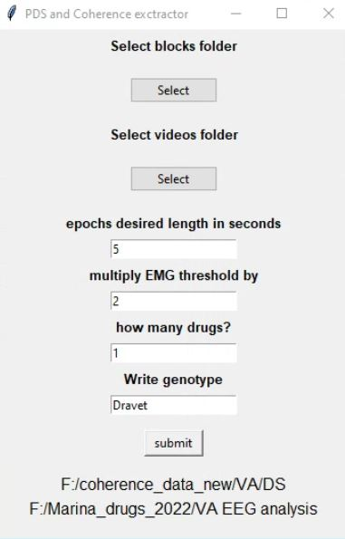

# Description

This is a graphical user interface for extracting quiet wakefulness power spectral density parameters and coherence for txt files exported from Labchart. 

If you use it in your research, please cite our publication: 

Quinn et al. (2022). Acute effect of antiseizure drugs on background oscillations in Scn1aA1783V Dravet syndrome mouse model

Please contact shirquinn (at) mail (dot) tau (dot) ac (dot) il with any questions or comments.

# Installation instructions and operation

1.	Make sure to install all required python packages: 
  conda install jupyter       
  pip install -U scikit-learn    
  conda install -c anaconda openpyxl    
  pip install pandas numpy tk pathlib scipy matplotlib seaborn moviepy pathlib statistics pytest-shutil regex pytest-timeit

2.	Download the notebooks: “PSD_COH_functions.ipynb” , “Extract PSD and Coherence.ipynb”
3.	Open “Extract PSD and Coherence.ipynb” via jupyter notebook
4.	Change line #2 to the path to PSD_COH_functions.ipynb file
5.	Click cell - > run all
6.	The GUI will open
7.	Choose path to folder with extracted blocks txt files. 

The text files should contain:

seconds, SomL-Cer voltage(or any left sided electrode), SomR-Cer voltage (or any right sided electrode), EMG voltage.

The text file should be called: 

'Subject ID' + block + number of block. 

for example, if I have a recording block pre drug administration and a recording block post drug administration, it will be called:

DS_1445 block1 (for pre drug administration)

DS_1445 block2 (for post drug administration)

8.	Choose path to folder with videos from ECoG recording .WMV extension
9.	Fill in desired length of epoch, usually 5 seconds.
10.	Fill in multiplier for EMG TKEO harmonic mean Threshold. For our data the best fit was 2, but If you are not getting enough epochs, increase this threshold. if you're getting too many epochs with movement - decrease this multiplier.
11.	insert number of drugs (or blocks) recorded. if none - input 0.

# Screenshots

